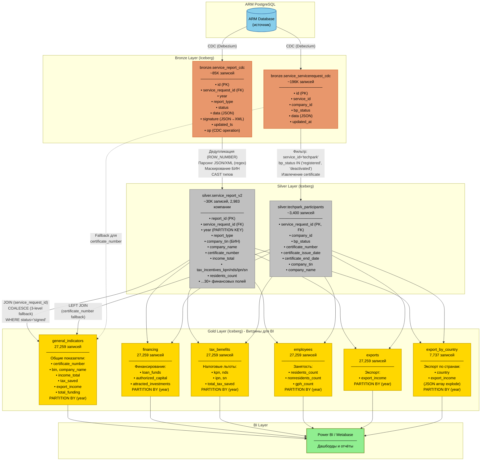

# Entity-Relationship Diagram (ERD) - Techorda Data Warehouse

## Схема данных: Bronze → Silver → Gold



## Ключевые трансформации

### Bronze → Silver

**1. service_report_cdc → service_report_v2**
- Дедупликация через `ROW_NUMBER() OVER (PARTITION BY id ORDER BY updated_ts DESC)`
- Парсинг БИН из XML: `regexp_extract(get_json_object(signature, '$.signed_xml'), '<tin>([0-9]+)</tin>', 1)`
- Извлечение 30+ финансовых показателей из JSON с `CAST AS BIGINT`
- Фильтрация: `op != 'd'` (исключение удалённых записей)

**2. service_servicerequest_cdc → techpark_participants**
- Фильтр: `service_id = 'techpark'` AND `bp_status IN ('registered', 'deactivated')`
- Извлечение сертификата: `get_json_object(data, '$.activation_info.certificate_number')`
- Парсинг БИН из search_field: `regexp_extract(search_field, 'БИН:\s*(\d+)', 1)`

### Silver → Gold

**3-уровневый COALESCE для certificate_number:**
```sql
COALESCE(
    NULLIF(sr.certificate_number, ''),      -- 1. Из отчёта
    p.certificate_number,                    -- 2. Из participants
    NULLIF(ss.cert_number, '-1')            -- 3. Из servicerequest (fallback)
)
```

**Результат:** Заполненность сертификатов увеличена с 85 пустых → 2 пустых (99.99%)

## Связи между таблицами

| Связь | Кардинальность | Тип JOIN | Назначение |
|-------|---------------|----------|------------|
| `silver.service_report_v2.service_request_id` → `silver.techpark_participants.service_request_id` | 1:1 | LEFT JOIN | Получение certificate_number |
| `silver.service_report_v2.service_request_id` → `bronze.service_servicerequest_cdc.id` | 1:1 | LEFT JOIN | Fallback для certificate_number |
| `silver.service_report_v2` → все Gold витрины | 1:N | FROM | Основной источник данных |

## Партиционирование

Все Gold-витрины партиционированы по полю `year` (INT) для оптимизации запросов:
- Годы: 2019, 2020, 2021, 2022, 2023, 2024, 2025, 2026
- Формат: `PARTITIONED BY (year)` (Apache Iceberg)

---

**Инструменты:**
- CDC: Debezium
- Storage: Apache Iceberg
- Engine: Apache Spark SQL
- Orchestration (planned): Apache Airflow
- BI: Power BI, Metabase
